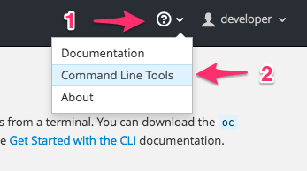

If you do not know what URL to use when logging in from the command line, but are already logged into the web console, you can find out the URL by visting the _Command Line Tools_ option under the help menu.

The page displayed will provide you with the URL, as well as the command to run to login. This command will include an access token you can use in place of needing to provide your user name and password.

You can click on the cut and paste icon to have the command, with the hidden token, automatically copied into your paste buffer. You can then paste the command into your terminal window.
