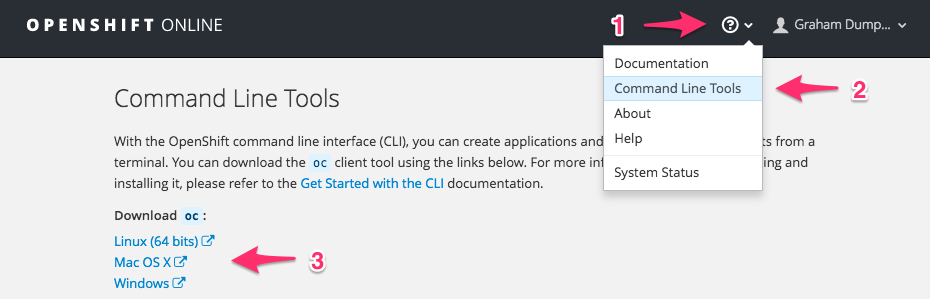

---
related:
    - accessing-an-openshift-cluster/what-url-do-i-use-when-logging-if-from-the-command-line.md
---

If you do not already have the ``oc`` command line tool, you can download the version corresponding to the OpenShift cluster you are using, from the web console.

You can also download the ``oc`` command line tool for OpenShift Origin from the [releases](https://github.com/openshift/origin/releases) page on GitHub. Ensure you download the correct ``openshift-origin-client-tools`` package for your platform and the specific version of OpenShift you are using. If you use the wrong client version for the OpenShift version being used, not all features may be available.

Once you have downloaded the correct package, depending on your platform, you will need to unpack it using ``unzip`` or ``tar``. Copy the ``oc`` program from the package into a directory on your application search path.
