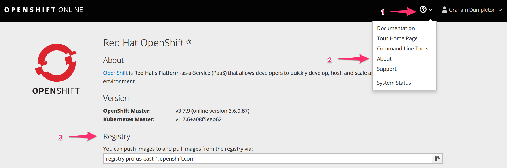

---
related:
    - image-registry-and-image-streams/how-do-i-import-an-image-from-an-external-image.md
---

When deploying a pre-existing application image it must be hosted on an external image registry, or exist in the internal image registry of OpenShift. One reason that an image may exist in the internal image registry is if it was built within OpenShift from either a ``Dockerfile``, or from application source code using a Source-to-Image (S2I) builder.

The internal image registry of OpenShift can also be loaded with a pre-existing application image by pushing the image from a local system using a tool such as ``docker push`` or ``buildah push``.

Before you can push an image to the internal registry you need to login to it using the tool you are using. The details for the internal image registry will be specific to the OpenShift cluster you are using. Check any documentation for the OpenShift environment you are using, or ask the cluster administrator. The details of the internal image registry may also be displayed on the _About_ page accessible from the OpenShift web console.



If you are already logged in to the OpenShift cluster from the command line, you can login to the internal image registry using the ``docker`` tool using:

```
$ docker login -u `oc whoami` -p `oc whoami --show-token` registry.pro-us-east-1.openshift.com:443
Login Succeeded
```

Next create an empty image stream in your project for the image using ``oc create imagestream``.

```
$ oc create imagestream guestbook
imagestream "guestbook" created
```

And tag the local image you wish to push with the details of the image registry, your project in OpenShift, the name of the image stream and image version tag.

```
$ docker tag kubernetes/guestbook registry.pro-us-east-1.openshift.com:443/cookbook/guestbook:latest
```

You are then ready to push the image to the OpenShift internal image registry.

```
$ The push refers to repository [registry.pro-us-east-1.openshift.com:443/cookbook/guestbook]
5f70bf18a086: Layer already exists
0b10d8731592: Pushed
b08b5a92e747: Pushed
89c69caaa06d: Pushed
59b0a875ac52: Pushed
5dbcf0efe4f2: Pushed
latest: digest: sha256:1ce7366fbc35b99b43d7e9e8de5131f313552a7eee57e157c92e8cc9d5a0a57f size: 6628
```
